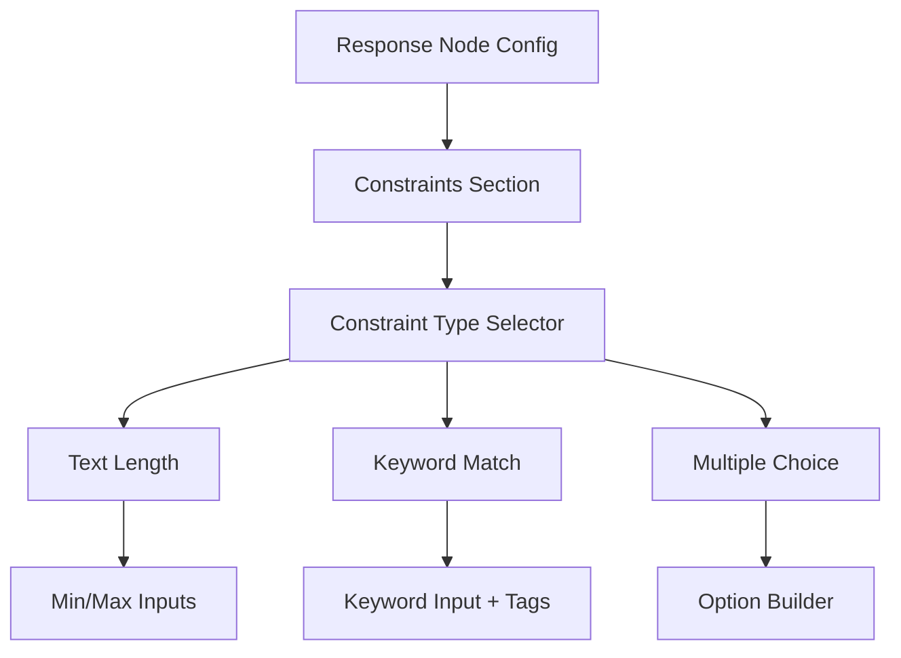
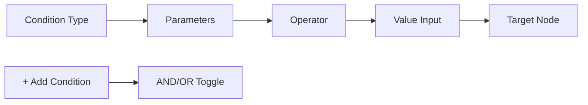
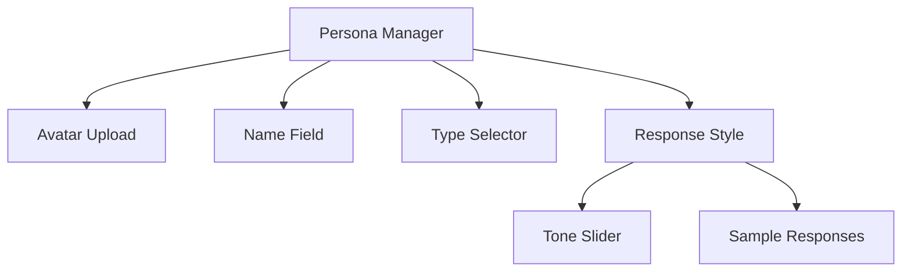
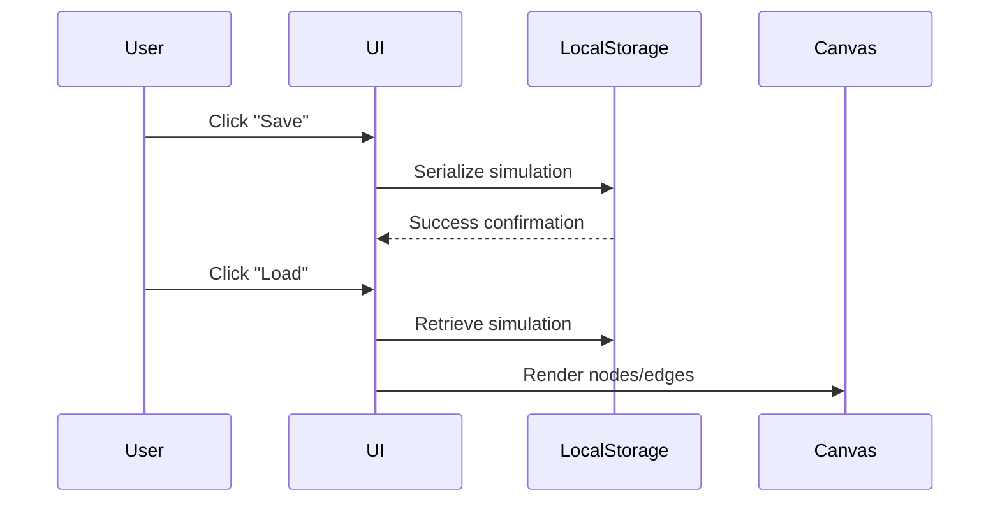
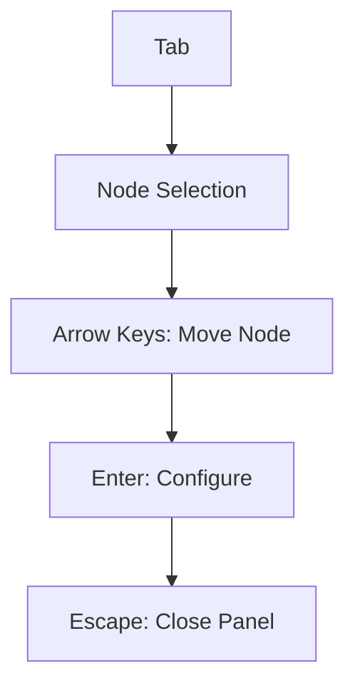

## Enhanced Frontend Prototype Specification: HR Simulation Builder

### Introduction
We're building a visual workflow builder for HR professionals to create branching assessment simulations. The interface centers around a React Flow canvas where users:
1. Create system-triggered interactions ("Behavior Prompts")
2. Define participant response points
3. Configure branching logic based on response analysis
4. Manage communication personas
All within a frontend-only prototype using browser storage.

### Core Terminology
1. **Behavior Prompt**: System-initiated interaction (email/chat/voice)
2. **Participant Response**: User response collection point
3. **Branching Logic**: Rules determining next steps
4. **Persona**: Pre-configured character for chat interactions
5. **Fallback Path**: Default route when no rules match

---

## UI/UX Specifications

### 1. Dashboard
- **Layout**:
  ```mermaid
  graph TD
    A[Header] --> B[“Simulation Builder” title]
    A --> C[Create New Button]
    D[Simulation List] --> E[Search Bar]
    D --> F[Sort Controls]
    D --> G[List Items]
  ```
- **Elements**:
  - Searchable/sortable list of simulation names
  - "Create New" primary button
  - No additional metadata (names only)
- **States**:
  - Hover: Item highlight
  - Active: Blue selection border

### 2. Canvas Workspace
- **Layout**:
  ```mermaid
  graph LR
    A[Node Palette] --> B[Canvas Area]
    B --> C[Properties Panel]
    D[Top Bar] --> E[Simulation Name]
    D --> F[Save/Load Controls]
    D --> G[Undo/Redo]
  ```
- **Visual Details**:
  - React Flow canvas with grid background
  - Connection handles: Circular indicators (top/bottom of nodes)
  - Valid connection targets: Pulse animation
  - Invalid connections: Red "X" icon

### 3. Node States
| State | Visual Treatment |
|-------|------------------|
| Default | Solid fill, medium contrast |
| Selected | Blue border (4px), drop shadow |
| Hover | Light blue glow |
| Invalid | Red border, warning icon |
| Active (drag) | Semi-transparent, ghost outline |

---

## Configuration Details

### 1. Response Type Constraints
**UI Components**:


**Implementation**:
- Text Length: Number inputs with character counters
- Keyword Match: Tag-based input with auto-suggest
- Multiple Choice: Dynamic option adder with radio buttons

### 2. Fallback Settings
**UI Flow**:
1. Toggle switch: "Enable Fallback Path"
2. Path selection:
   - Dropdown: "Select target node"
   - "Create new node" option
3. Visual feedback:
   - Dashed connector line (canvas)
   - Special fallback icon in properties panel

### 3. Voice Prompt Configuration
**UI Elements**:
- Script editor with line numbering
- Voice profile dropdown:
  - Male Calm
  - Female Professional
  - Neutral AI
- Simulated call controls:
  - Play/Pause buttons
  - Speed selector (0.5x-2x)
- Call metadata:
  - Duration limit
  - Max interruptions

### 4. Branching Rule Logic
**Rule Builder UI**:


**Components**:
- Drag-and-drop condition blocks
- Natural language preview: 
  "IF [response] CONTAINS 'urgent' → GO TO [Node 4]"
- Complex logic groups: Collapsible condition sets

### 5. Persona Management
**Persona Creation**:


**Assignment Workflow**:
1. Drag persona from sidebar to chat node
2. Visual confirmation: Persona avatar appears on node
3. Node properties show assigned persona details

**AI Simulation**:
- Response templates with placeholder variables
- Simulated delay settings (0-60 seconds)
- Simple keyword → response mapping

---

## Core Functionality Implementation

### 1. Save/Load System
**Data Flow**:


**Components**:
- Save: Export to JSON + localStorage
- Load: Import from localStorage + validation
- Auto-save: Debounced 30-second intervals

### 2. Error Handling System
**Validation Matrix**:
| Error Type | Detection Method | UI Feedback |
|------------|------------------|-------------|
| Missing required field | On-blur validation | Red outline + tooltip |
| Invalid connection | Connection handler | Rejected snap + toast |
| Orphaned node | Graph analysis | Pulsating warning |
| Timeout conflict | Constraint checker | Conflict highlight |

**Feedback Mechanisms**:
- Inline error messages
- Toast notifications
- Canvas visual indicators
- Audio alerts (optional)

### 3. Accessibility Features
**Keyboard Navigation**:


**Screen Reader Support**:
- ARIA labels for all interactive elements
- Live regions for canvas updates
- High-contrast theme option
- Keyboard shortcut cheat sheet

### 4. Canvas Enhancements
**Feature Set**:
1. Undo/Redo: Zustand middleware with 50-step history
2. Copy/Paste: Serialize/deserialize node groups
3. Node Grouping: Collapsible container nodes
4. Mini-map: React Flow MiniMap component
5. Smart Layout: Dagre auto-layout algorithm

---

## Data Models (TypeScript)

### Core Interfaces
```typescript
interface Simulation {
  id: string;
  name: string;
  nodes: Node[];
  edges: Edge[];
  personas: Persona[];
  createdAt: Date;
}

interface BaseNode {
  id: string;
  type: 'email' | 'chat' | 'voice' | 'response';
  position: { x: number; y: number };
}

interface EmailPromptNode extends BaseNode {
  type: 'email';
  data: {
    sender: string;
    subject: string;
    body: string;
    attachments: string[];
  };
}

interface ResponseNode extends BaseNode {
  type: 'response';
  data: {
    timeLimit: number; // Minutes (0-180)
    constraints: {
      textLength?: { min?: number; max?: number };
      keywords?: string[];
      options?: string[]; // Multiple choice
    };
    fallback: {
      targetNodeId: string | null;
      timeoutMinutes: number;
    };
  };
}

interface Edge {
  id: string;
  source: string;
  target: string;
  rules: Rule[];
}

interface Rule {
  type: 'keyword' | 'tone' | 'length' | 'choice';
  params: {
    // Flexible params based on type
    keywords?: string[];
    toneThreshold?: number;
    operator?: '<' | '>' | '==';
    value?: string | number;
  };
}
```
---

## Assumptions & Constraints

1. **Frontend-Only**:
   - All data persists in localStorage
   - No backend API integration
   - Voice processing simulated via Web Speech API

2. **Time Constraints**:
   - Max session duration: 180 minutes
   - Countdown timers on response nodes
   - Time compression for testing

3. **Performance**:
   - Max nodes per simulation: 500
   - Virtualized canvas rendering
   - Debounced state updates

4. **Browser Support**:
   - Chromium-based browsers (Chrome, Edge)
   - Firefox (latest)
   - Mobile: Not supported
  
---

## Future Enhancement Roadmap

1. **Simulation Preview**:
   - Participant view simulator
   - Time-skipping controls
   - Branching path visualizer

2. **Advanced Analytics**:
   - Path completion metrics
   - Time-per-step analysis
   - Response quality scoring

3. **Collaboration Features**:
   - Real-time co-editing
   - Comment threads
   - Version history

4. **Media Enhancements**:
   - Video interaction nodes
   - Document review simulations
   - Calendar integration


This specification provides complete UI/UX details and implementation guidelines for building a self-contained frontend prototype using React Flow, with all critical elements addressed through browser-based solutions.