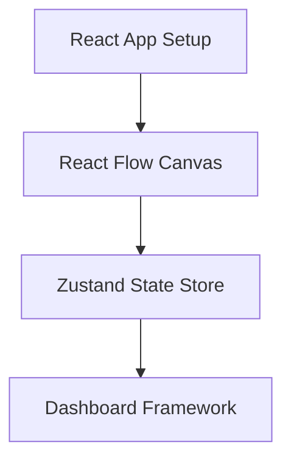
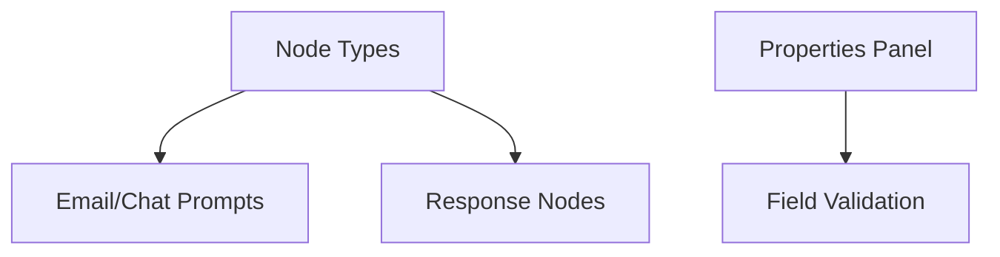
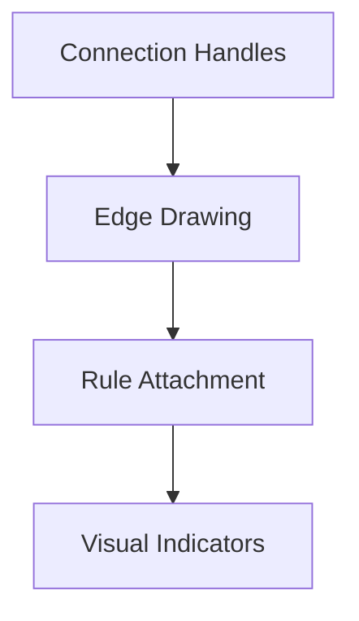
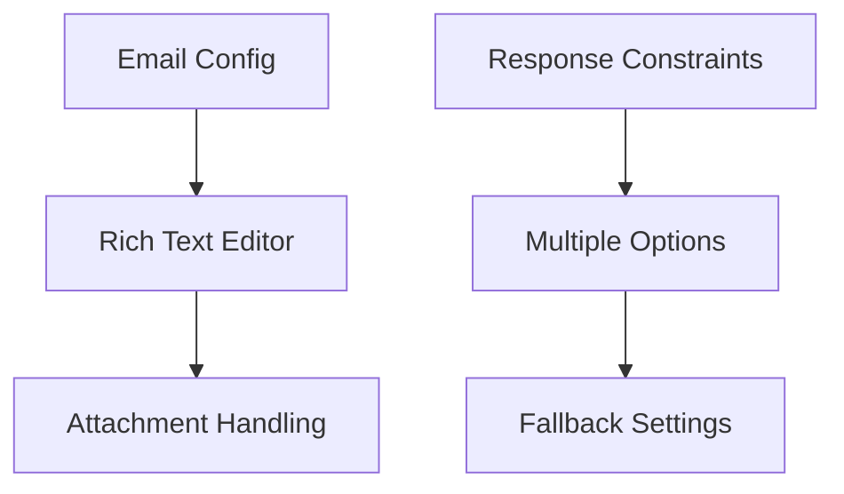
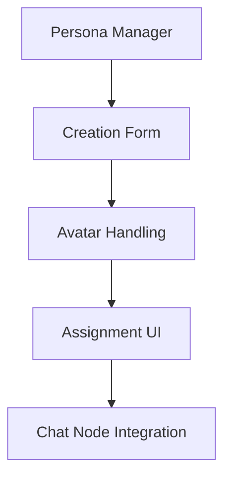
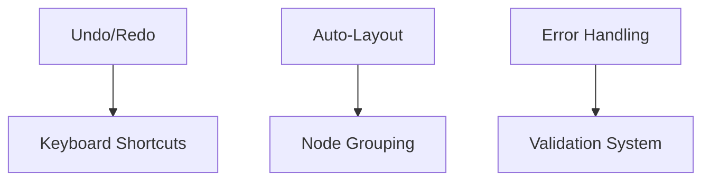
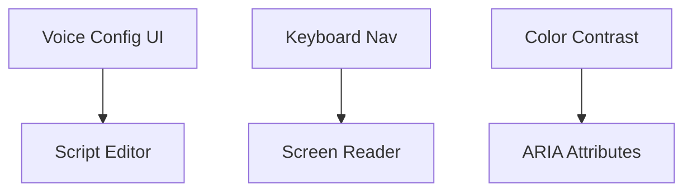
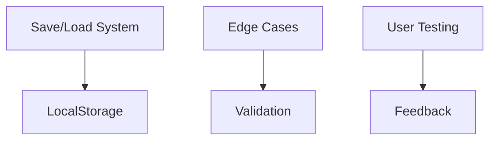
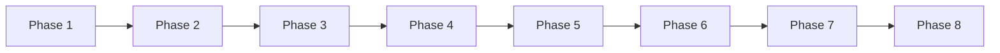
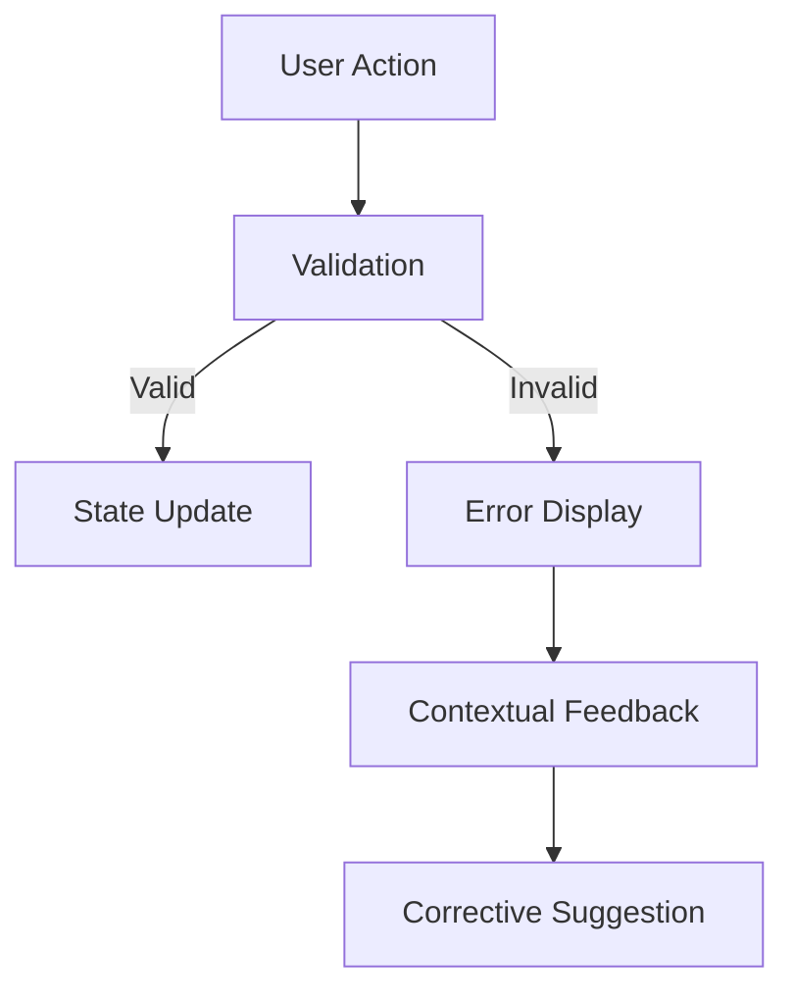

## Phased Frontend Prototype Implementation Plan

### Phase 1: Core Infrastructure & Dashboard

**Objective**: Establish foundation and simulation management


**Components**:
1. Simulation list (localStorage persistence)
2. Create new simulation flow:
   - Name input field
   - Initial trigger selector (email/chat)
3. Canvas container with grid
4. Basic node palette skeleton

**Data Structure**:
```typescript
interface Simulation {
  id: string;
  name: string;
}
```

### Phase 2: Node System & Basic Configuration

**Objective**: Implement drag-and-drop nodes with simple config


**Components**:
1. Node palette with drag sources
2. Canvas drop targets
3. Node renderers (visual styling)
4. Contextual properties panel
5. Basic text/number inputs

**Data Structure Expansion**:
```typescript
interface BaseNode {
  id: string;
  type: 'email' | 'chat' | 'response';
  position: { x: number; y: number };
}
```

### Phase 3: Connection System & Branching

**Objective**: Create node relationships with rules


**Components**:
1. Connection handles on nodes
2. Edge creation logic
3. Rule builder UI:
   - Condition type dropdown
   - Parameter inputs
   - Target node selector
4. Connection validation

**Data Structure Expansion**:
```typescript
interface Edge {
  id: string;
  source: string;
  target: string;
  rules: Rule[];
}

interface Rule {
  type: 'keyword' | 'length';
  params: Record<string, any>;
}
```

### Phase 4: Advanced Node Configuration

**Objective**: Complete all node-specific settings


**Components**:
1. Rich text editor (email body)
2. Response constraints:
   - Text length limits
   - Keyword requirements
   - Multiple choice options
3. Fallback path selector
4. Time limit settings (0-180 min)

**Data Structure Expansion**:
```typescript
interface EmailPromptNode extends BaseNode {
  data: {
    sender: string;
    subject: string;
    body: string;
    attachments: string[];
  };
}
```

### Phase 5: Persona Management System

**Objective**: Implement chat character system


**Components**:
1. Persona sidebar
2. Creation/editing form
3. Avatar upload/cropping
4. Drag-to-assign workflow
5. Response style configuration

**Data Structure Expansion**:
```typescript
interface Persona {
  id: string;
  name: string;
  type: 'AI' | 'Human';
  responseStyle: string;
}

interface ChatPromptNode extends BaseNode {
  data: {
    channelName: string;
    personaId: string;
    initialMessage: string;
  };
}
```

### Phase 6: Polish & Quality of Life

**Objective**: Add productivity enhancements


**Components**:
1. Undo/redo history stack
2. Canvas auto-layout algorithm
3. Node grouping/collapsing
4. Comprehensive error validation
5. Keyboard navigation support

### Phase 7: Voice Integration & Accessibility

**Objective**: Add voice prompts and a11y


**Components**:
1. Voice prompt configuration:
   - Script editor
   - Voice profile selector
   - Call parameters
2. Full keyboard navigation
3. Screen reader support
4. High-contrast theme

**Data Structure Expansion**:
```typescript
interface VoicePromptNode extends BaseNode {
  data: {
    callerId: string;
    voiceProfile: string;
    script: string;
    maxDuration: number;
  };
}
```

### Phase 8: Final Integration & Testing

**Objective**: Combine systems and validate


**Components**:
1. Complete save/load system
2. Comprehensive error handling
3. Responsive design checks
4. User testing scenarios
5. Performance optimization

---

## Phase Implementation Notes

### Atomic Development Approach
1. **Component Isolation**: Build each component in Storybook first
2. **State Management**: Use Zustand for cross-phase compatibility
3. **Data Contracts**: Maintain strict TypeScript interfaces
4. **Progressive Enhancement**: Add features incrementally

### Phase Dependencies


### Testing Strategy Per Phase
| Phase | Testing Focus | Tools |
|-------|---------------|-------|
| 1 | Dashboard functionality | Jest |
| 2 | Node drag-and-drop | React Testing Library |
| 3 | Connection validation | Cypress |
| 4 | Form input validation | Jest + Yup |
| 5 | Persona assignment | Storybook interactions |
| 6 | Undo/redo reliability | Cypress |
| 7 | Keyboard navigation | Axe + Keyboard tester |
| 8 | Cross-browser compatibility | BrowserStack |

### Error Handling Implementation


This phased approach allows for incremental development within token limits while maintaining:
- Strict type safety throughout
- Isolated component development
- Clear phase completion criteria
- Progressive enhancement
- Test coverage at each stage
- React Flow as the consistent canvas foundation

Each phase delivers a testable artifact while building toward the complete prototype.